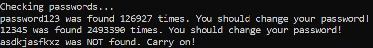

# Password Analyser

## Screenshots

## Inspiration
Few days ago, I learnt that one of the websites that I registered on had been breached. After few google searches, I came across https://haveibeenpwned.com/ which checks against all the emails and passwords that were compromised as a result of a data breach. I quickly wrote my password in the search box and it showed the password had been found. I changed the password but more importantly I realised that I wrote my password in a search box on the internet, which can be intercepted by a hacker too. So I set on finding a better way of checking passwords in a data breach, and came across the API of the same website that uses k-anonymity to check against their database. Hence, I created a python script that uses their API to check the passwords. Since the passwords are temporarily stored locally and never sent over the internet, it's hypothetically more secure.
## How It Works
The script hashes the passwords from passwords.txt file to SHA1 hashed. Afterwards, only the first five characters of this hashed password is sent over to API, which helps achieve k-anonymity. The API sends back all the matched hashed passwords and the number of times they were found. The received list of hashed passwords is traversed through to find a match for our original password. After all the passwords have been checked, the passwords.txt is cleared.
## How To Use
- Add the passwords, separated by a new line, in the passwords.txt file.
- Run the checkmypass.py file and an output will be displayed in command line/terminal 

## End 
